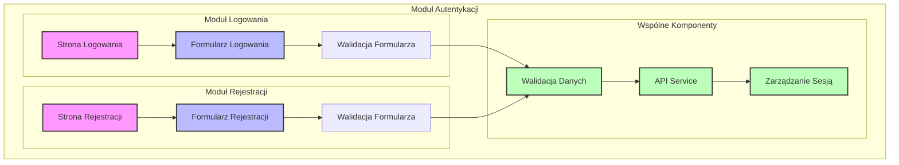

<architecture_analysis>
Komponenty wymienione w specyfikacji:
- Strona Logowania: Strona zawierająca widok logowania, renderująca Formularz Logowania.
- Formularz Logowania: Komponent React odpowiedzialny za przyjmowanie danych logowania i wysyłanie ich do walidacji.
- Strona Rejestracji: Strona zawierająca widok rejestracji, renderująca Formularz Rejestracji.
- Formularz Rejestracji: Komponent React przyjmujący dane rejestracyjne nowego użytkownika.
- Walidacja Danych: Mechanizm lub komponent sprawdzający poprawność danych wprowadzonych przez użytkownika.
- Zarządzanie Sesją: Logika zarządzania sesjami użytkowników, która ustala stan logowania i przetwarza tokeny.

Główne strony i komponenty:
- Logowanie: Składa się ze Strony Logowania oraz Formularza Logowania.
- Rejestracja: Składa się ze Strony Rejestracji oraz Formularza Rejestracji.

Przepływ danych:
1. Użytkownik wprowadza dane na Stronie Logowania lub Rejestracji.
2. Formularz przesyła dane do modułu Walidacji Danych.
3. Po pomyślnej walidacji dane trafiają do Zarządzania Sesją, co kończy proces logowania lub rejestracji.

Opis funkcjonalności:
- Strona Logowania i Rejestracji: Odpowiedzialne za prezentację formularzy i interfejs użytkownika.
- Formularze: Zbierają dane od użytkownika i inicjują walidację.
- Walidacja Danych: Sprawdza poprawność danych, informuje użytkownika o błędach.
- Zarządzanie Sesją: Utrzymuje stan sesji, zarządza tokenami i autoryzacją.
</architecture_analysis>

